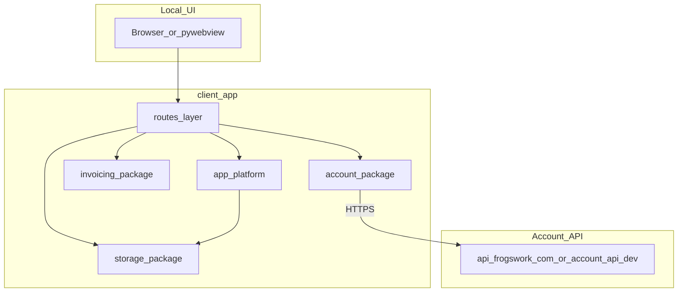

# FrogsWork client architecture

Desktop sales invoicing app: Flask serves a local web UI; pywebview wraps it in a Windows window (or the system browser in dev mode).

## Request flow



## Module map

| Module | Role |
|--------|------|
| [`app.py`](app.py) | Flask app, error handlers, template filters, nav context, desktop `main()` |
| [`routes/`](routes/) | HTTP routes (invoices, customers, settings, welcome, account, backup, system) |
| [`storage/`](storage/) | AppData JSON, PDF folder, invoice records (`import storage` re-exports API) |
| [`account/`](account/) | Auth store, API client, entitlements, trial meter, checkout handoff |
| [`invoicing/`](invoicing/) | Invoice forms, formatting, due dates, PDF, email compose, GST |
| [`app_platform/`](app_platform/) | OS/desktop glue: paths, dialogs, updates, window state, Win uninstall hook |
| [`desktop_shell.py`](desktop_shell.py) | pywebview window, splash (Win + future Mac desktop entry) |
| [`app_config.py`](app_config.py) | Brand, version, trial limits, API URL defaults |
| [`ui_config.py`](ui_config.py) | Template placeholders and idle timeout |

### `app_platform/` layout

Named `app_platform` (not `platform`) to avoid shadowing Python’s stdlib `platform` module.

| File | Role |
|------|------|
| [`capabilities.py`](app_platform/capabilities.py) | `is_windows()`, `is_desktop()`, `is_packaged()` |
| [`paths.py`](app_platform/paths.py) | `user_data_dir_path()` (platformdirs), `resource_path`, `exe_dir`, PDF resolve |
| [`window_state.py`](app_platform/window_state.py) | Desktop window geometry persistence |
| [`folder_picker.py`](app_platform/folder_picker.py) | Folder picker (pywebview / tkinter) |
| [`backup.py`](app_platform/backup.py) | Backup ZIP + save dialog |
| [`updates.py`](app_platform/updates.py) | Packaged in-app updates |
| [`win/uninstall.py`](app_platform/win/uninstall.py) | `--export-uninstall-data` (Windows Inno Setup hook) |

## Portability constraints

Refactors use these rules so future targets (macOS desktop, possible browser/PWA client) do not require reshaping business packages:

| Rule | Implication |
|------|-------------|
| Business logic stays OS-agnostic | `routes/`, `invoicing/`, `account/`, `storage/` (data rules) avoid `sys.platform` |
| OS glue lives in `app_platform/` | Dialogs, updates, uninstall hooks, `user_data_dir_path()` |
| Capability checks are centralized | Prefer `app_platform.capabilities` over scattered `sys.platform` |
| Win-only code is identifiable | `app_platform/win/`; `pyi_runtime_hook.py` and `installer/` stay Windows-specific at root |
| Account crypto ≠ installer lifecycle | `account/install_secret.py` stays in `account/` |
| HTTP-shaped account layer | `account/` client unchanged for any future browser client |

## JavaScript

Server-rendered Flask UI — JS is used only where the browser must react without a full page reload:

| Asset | Purpose |
|-------|---------|
| [`static/gst_registration_ui.js`](static/gst_registration_ui.js) | Toggle ABN required when GST radio changes |
| [`static/due_rule_ui.js`](static/due_rule_ui.js) | Live due-date preview (must stay in sync with `invoicing/due_dates.py`) |
| [`static/create_invoice_ui.js`](static/create_invoice_ui.js) | Line items, invoice number edit, draft customer |
| [`static/account_subscribe_poll.js`](static/account_subscribe_poll.js) | Poll subscribe status after Stripe checkout |
| [`static/settings_account_status.js`](static/settings_account_status.js) | Poll entitlement status on account settings |
| Inline in [`base.html`](templates/base.html) | Ping keepalive + invoice action menus (needs `url_for`) |

**Due dates:** `due_rule_ui.js` duplicates `invoicing/due_dates.py` on purpose for live preview. Change both when due-date rules change.

Small inline `<script>` blocks with Jinja `url_for` / `tojson` are fine. Config for extracted scripts is passed via `<script type="application/json" id="...">`.

## AppData layout

`%APPDATA%\FrogsWork\` on Windows (via `app_platform.paths.user_data_dir_path()` → `storage.get_bootstrap_dir()`):

| File / folder | Purpose |
|---------------|---------|
| `settings.json` | Business details, GST, due-date prefs, welcome flag |
| `customers.json` | Customer directory |
| `invoices.json` | Invoice index (status, amounts, PDF filename) |
| `pdfs/` | Generated invoice PDFs (or custom folder via settings) |
| `entitlement_cache.json` | Last-known subscription status |
| `account_auth.json` | Account login tokens (encrypted; migrates from legacy `billing_auth.json`) |
| `bootstrap.json` | PDF folder preference |

## Subscription vs invoice logic

- **Trial:** `account/trial_stats.py` sums lifetime invoices from `invoices.json`. `account/entitlement_guard.py` blocks generate when limits exceeded.
- **Subscribed:** `account/sync.py` fetches `GET /entitlements` from the account API. Result cached in `entitlement_cache.json` with 14-day offline grace.
- **Invoices:** All customer/PDF data stays local. Only account auth and entitlement checks hit the network.

## Local development

From repo root:

```powershell
.\scripts\start-dev.ps1 -DevBrowser
```

Starts `account_api/dev` (port 8787) and `client_app` (port 5000). Copy `account_api/dev/.dev.vars.example` to `.dev.vars` for Stripe test keys.

Seed sample data:

```powershell
python client_app/seed_dev_data.py
```

Production account API: [`account_api/worker/`](../account_api/worker/).
