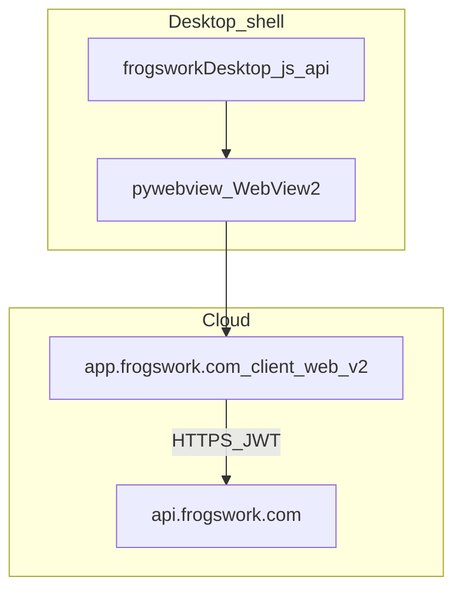

# FrogsWork client architecture

Windows desktop shell: pywebview + WebView2 loads the shared Cloud UI (`client_web_v2` at `app.frogswork.com`). Splash, window geometry, Inno packaging, and the updater stay native.

## Request flow



## Module map

Operator docs: [`../docs/README.md`](../docs/README.md)

| Module | Role |
|--------|------|
| [`app.py`](app.py) | Entry: uninstall argv gate, then open the Cloud shell |
| [`desktop_shell.py`](desktop_shell.py) | Splash, window geometry, navigate to Cloud URL, inject `window.frogsworkDesktop` |
| [`app_config.py`](app_config.py) | Brand, version, `DESKTOP_APP_URL`, `CLOUD_API_URL` |
| [`app_platform/`](app_platform/) | Paths, updates, window state, external browser, Win uninstall export |
| [`account/`](account/) | Entitlement cache helpers, telemetry (shell heartbeat), auth helpers for updater |
| [`storage/`](storage/) | AppData paths used by updater / legacy helpers (invoice UI is Cloud) |
| [`invoicing/`](invoicing/) | Shared GST/format helpers retained for tests and any local utilities |

### `app_platform/` layout

Named `app_platform` (not `platform`) to avoid shadowing Python’s stdlib `platform` module.

| File | Role |
|------|------|
| [`capabilities.py`](app_platform/capabilities.py) | `is_windows()`, `is_desktop()`, `is_packaged()` |
| [`paths.py`](app_platform/paths.py) | `user_data_dir_path()`, `resource_path`, `exe_dir` |
| [`window_state.py`](app_platform/window_state.py) | Desktop window geometry persistence |
| [`external_browser.py`](app_platform/external_browser.py) | Open marketing/billing URLs in the system browser |
| [`updates.py`](app_platform/updates.py) | Packaged in-app updates |
| [`win/uninstall.py`](app_platform/win/uninstall.py) | `--export-uninstall-data` (Windows Inno Setup hook) |

## Host contract

The Cloud UI detects the shell via `window.frogsworkDesktop` (see `client_web_v2/src/lib/host.ts`):

- `apiBase` — optional API override (staging)
- `openExternal(url)` — open https links in the system browser

Env overrides:

- `FROGSWORK_DESKTOP_APP_URL` — UI URL (default `https://app.frogswork.com`; use Vite for local UI iteration)
- `FROGSWORK_ACCOUNT_API_URL` — API base injected into the host bridge

## AppData layout

`%APPDATA%\FrogsWork\` on Windows (via `app_platform.paths.user_data_dir_path()`):

| File / folder | Purpose |
|---------------|---------|
| `window_state.json` | Saved window geometry |
| `update_state.json` / `update/` | In-app updater |
| `account_install.json` | Install secret for telemetry |
| Legacy JSON / `pdfs/` | Older Local installs; Cloud data lives on the API |

## Entitlements

Access is enforced by the Cloud app and API: signed-in + active Stripe subscription (`active` / `trialing`). Stripe coupons / subscription trials are the only free-period mechanism.

## Local development

From repo root:

```powershell
.\scripts\start-dev.ps1
```

Or run the shell against local Vite:

```powershell
$env:FROGSWORK_DESKTOP_APP_URL = "http://127.0.0.1:5173"
$env:FROGSWORK_ACCOUNT_API_URL = "http://127.0.0.1:8787"
cd client_app
python app.py
```

## Packaging

See [`installer/README.md`](installer/README.md) and [`../docs/DEPLOY.md`](../docs/DEPLOY.md). Single Cloud-oriented Windows artifact (setup.exe + update zip).
