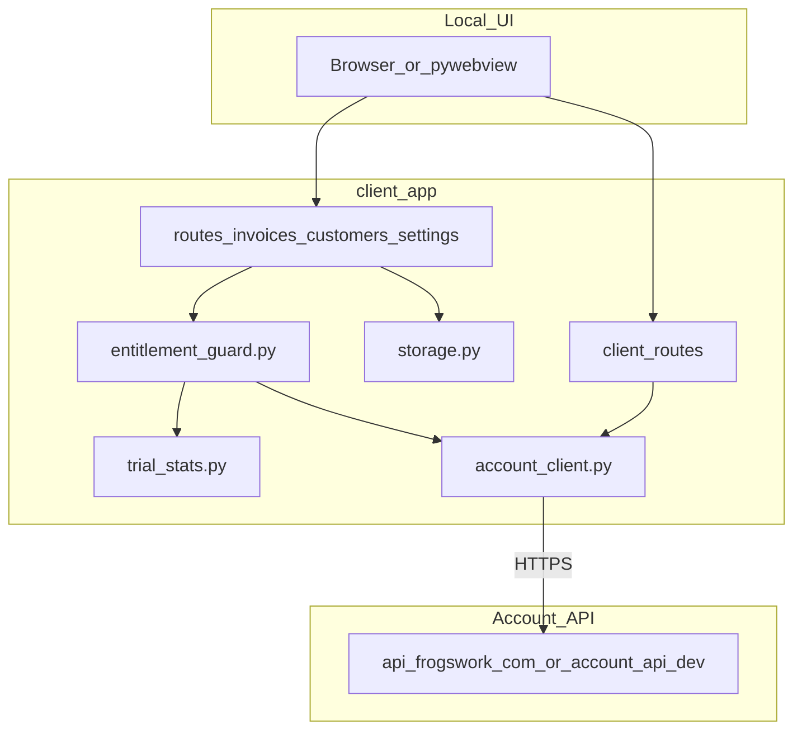

# FrogsWork client architecture

Desktop sales invoicing app: Flask serves a local web UI; pywebview wraps it in a Windows window (or the system browser in dev mode).

## Request flow



## Module map

| Module | Role |
|--------|------|
| [`app.py`](app.py) | Flask app, error handlers, template filters, nav context, desktop `main()` |
| [`routes/invoices.py`](routes/invoices.py) | Home, create/preview/generate, past invoices, PDF view, send |
| [`routes/customers.py`](routes/customers.py) | Customer list, add, edit, delete |
| [`routes/settings.py`](routes/settings.py) | Settings hub, business details, account, storage, updates |
| [`routes/system.py`](routes/system.py) | Ping, shutdown, idle watchdog |
| [`client_routes.py`](client_routes.py) | Welcome wizard, account signup/login, dashboard, backup |
| [`invoice_form.py`](invoice_form.py) | Line items, invoice draft session, preview rendering |
| [`invoice_format.py`](invoice_format.py) | Money, dates, ABN, invoice number formatting |
| [`paths.py`](paths.py) | Resource paths, PDF file resolution |
| [`storage.py`](storage.py) | AppData JSON, PDF folder, invoice records |
| [`pdf_generator.py`](pdf_generator.py) | Invoice PDF layout |
| [`entitlement_guard.py`](entitlement_guard.py) | Trial/subscription gate on generate |
| [`entitlement_cache.py`](entitlement_cache.py) | Cached subscription status + offline grace |
| [`trial_stats.py`](trial_stats.py) | Lifetime trial totals from `invoices.json` |
| [`account_client.py`](account_client.py) | HTTP client for account API |
| [`account_sync.py`](account_sync.py) | Background entitlement sync |
| [`desktop_shell.py`](desktop_shell.py) | pywebview window, splash, single-instance |
| [`app_config.py`](app_config.py) | Brand, version, trial limits, API URL defaults |

## AppData layout

`%APPDATA%\FrogsWork\` (see `storage.get_bootstrap_dir()`):

| File / folder | Purpose |
|---------------|---------|
| `settings.json` | Business details, GST, due-date prefs, PDF folder path |
| `customers.json` | Customer directory |
| `invoices.json` | Invoice index (status, amounts, PDF filename) |
| `pdfs/` | Generated invoice PDFs (or custom folder via settings) |
| `entitlement_cache.json` | Last-known subscription status |
| `auth.json` | Account login tokens (encrypted) |
| `install_secret.json` | Per-install crypto material |

## Subscription vs invoice logic

- **Trial:** `trial_stats` sums lifetime invoices from `invoices.json`. `entitlement_guard.check_generate_access()` blocks when limits exceeded.
- **Subscribed:** `account_sync` fetches `GET /entitlements` from the account API. Result cached in `entitlement_cache.json` with 14-day offline grace.
- **Invoices:** All customer/PDF data stays local. Only account auth and entitlement checks hit the network.

## Local development

From repo root:

```powershell
.\scripts\start-dev.ps1 -DevBrowser
```

Starts `account_api/dev` (port 8787) and `client_app` (port 5000). Copy `account_api/dev/.dev.vars.example` to `.dev.vars` for Stripe test keys.

Seed sample data:

```powershell
python client_app/seed_dev_data.py
```

Production account API: [`account_api/worker/`](../account_api/worker/).
