# FrogsWork database schema

Relational storage reference for the canonical schema in
[`account_api/schema.sql`](../account_api/schema.sql). For the JSON document
payload contract, see [DOCUMENT-SCHEMA.md](DOCUMENT-SCHEMA.md).

## Storage stack

Production uses the Cloudflare D1 database `frogswork-account`. The local
Python API uses SQLite at `account_api/dev/account_api.db`. Both use the same
SQL schema.

## Entity relationships

This diagram emphasizes ownership and operational relationships. The
`guest_workspaces` to `email_outbox` relationship is logical; `guest_id` does
not have a SQL foreign-key constraint.

```mermaid
erDiagram
  users ||--o{ installs : "user_id"
  users ||--o{ account_devices : "user_id"
  users ||--o{ doc_businesses : "user_id"
  users ||--o{ doc_customers : "user_id"
  users ||--o{ doc_invoices : "user_id"
  users ||--o{ doc_quotes : "user_id"
  users ||--o| doc_settings : "user_id"
  users ||--o{ email_outbox : "user_id"
  users ||--o{ password_reset_tokens : "user_id"
  users ||--o{ email_verification_tokens : "user_id"
  users ||--o{ auth_handoff_codes : "user_id"
  guest_workspaces ||--o{ email_outbox : "guest_id (logical)"

  users {
    integer id PK
    text email UK
    text storage_tier
    text account_status
    text stripe_customer_id
    text subscribed_at
    text cancel_scheduled_at
    text unsubscribed_at
    text created_at
  }
  installs {
    text install_id PK
    integer user_id FK
    text first_seen_at
    text last_seen_at
    text subscription_state
  }
  doc_businesses {
    integer user_id PK
    text name PK
    text data_json
    integer revision
    text updated_at
  }
  doc_customers {
    integer user_id PK
    text name PK
    text data_json
    integer revision
    text updated_at
  }
  doc_invoices {
    integer user_id PK
    text invoice_key PK
    integer invoice_number
    text data_json
    text pdf_status
    text pdf_r2_key
  }
  doc_quotes {
    integer user_id PK
    text quote_key PK
    integer quote_number
    text data_json
    text pdf_status
    text pdf_r2_key
  }
  doc_settings {
    integer user_id PK
    text data_json
    integer revision
    text updated_at
  }
  password_reset_tokens {
    integer id PK
    integer user_id FK
    text token_hash UK
    text expires_at
    text used_at
  }
  email_verification_tokens {
    integer id PK
    integer user_id FK
    text token_hash UK
    text expires_at
    text used_at
  }
  auth_handoff_codes {
    integer id PK
    integer user_id FK
    text code_hash UK
    text expires_at
    text used_at
  }
  guest_workspaces {
    text guest_id PK
    text data_json
    text expires_at
  }
  email_outbox {
    text id PK
    integer user_id FK
    text guest_id
    integer invoice_number
    text invoice_key
    text doc_type
    text status
    integer attempts
  }
  rate_limit_buckets {
    text bucket_key PK
    text window_start
    integer count
  }
  account_devices {
    integer user_id FK
    text device_id_hash
    text platform
    text last_seen_at
  }
```

The disconnected nodes are standalone operational tables with no foreign-key
relationships.

## Table groups

### Account and authentication

- **`users`** is the account root. `email` is unique; subscription and access
  state are represented by `stripe_customer_id`, `storage_tier`, and
  `account_status`. Subscription lifecycle fields (`subscribed_at`,
  `cancel_scheduled_at`, `unsubscribed_at`, `plan_interval`) support
  privacy-friendly churn aggregates. It also records email verification and an
  optional originating `install_id`.
- **`account_devices`** stores hashed device IDs + platform enums per user for
  multi-device aggregates (no raw device UUID at rest).
- **`password_reset_tokens`**, **`email_verification_tokens`**, and
  **`auth_handoff_codes`** belong to a user. Each stores a unique token/code
  hash plus expiry, use, and creation timestamps; raw secrets are not stored.
  Handoff codes are single-use (~60s) for frogswork.com → app.frogswork.com.
- **`rate_limit_buckets`** stores a `bucket_key`, window start, and request
  count. It is operational state and is not linked to a user by a foreign key.

### Telemetry and funnel

- **`installs`** is keyed by `install_id` and can be linked to `users` through
  nullable `user_id`. It records first/last activity, funnel milestones,
  subscription lifecycle, aggregate usage, backup activity, and app-version
  metadata. See the canonical schema for the full telemetry column list.
  Primary product metrics now come from `doc_*` + `users` via
  `GET /metrics/summary` rather than the removed `/admin` dashboard.

### Cloud documents

All cloud document rows are tenant-owned:

- **`doc_businesses`** — composite key `(user_id, name)`.
- **`doc_customers`** — composite key `(user_id, name)`.
- **`doc_invoices`** — composite key `(user_id, invoice_key)`, with a
  per-user invoice-number index and PDF status/R2-key columns.
- **`doc_quotes`** — composite key `(user_id, quote_key)`, same PDF columns;
  optional Quotes feature (see `quotes_enabled` in settings).
- **`doc_settings`** — one row per user because `user_id` is its primary key.

The business, customer, invoice, quote, and settings payloads live in `data_json`.
Rows also carry `revision` and `updated_at` for synchronization. Relational
columns provide tenant ownership, stable lookup keys, and selected operational
metadata; they do not normalize the full document payload.

### Guest workspaces and email

- **`guest_workspaces`** stores an expiring JSON workspace keyed by
  `guest_id`.
- **`email_outbox`** tracks queued invoice/quote email delivery, attempts, errors,
  and status. `doc_type` is `invoice` (default) or `quote`. A row can be associated
  with an authenticated `user_id` or a logical `guest_id`; only `user_id` has a SQL
  foreign key.

## Tenant isolation

FrogsWork uses one shared D1 database. Tenant isolation is enforced in the
Worker by scoping cloud-document queries and mutations with `user_id`; D1 does
not provide database row-level security for these tables. Composite document
keys include `user_id` so names and invoice keys can repeat across accounts.

Generated PDFs are stored outside SQL in the private R2 bucket
`frogswork-user-docs` under `user-docs/{user_id}/invoices/...` and
`user-docs/{user_id}/quotes/...`. The SQL row keeps the corresponding `pdf_r2_key`.

## What is not represented relationally

- Invoice-to-customer and invoice-to-business links are fields inside each
  invoice's `data_json`, not SQL foreign keys.
- Most business-domain fields are inside the document tables' `data_json`.
  [DOCUMENT-SCHEMA.md](DOCUMENT-SCHEMA.md) documents that JSON contract.
- Browser IndexedDB is a client cache for cloud accounts, not the source of
  truth. D1 is the cloud account's authoritative document store; R2 is the
  authoritative store for generated PDF bytes.
