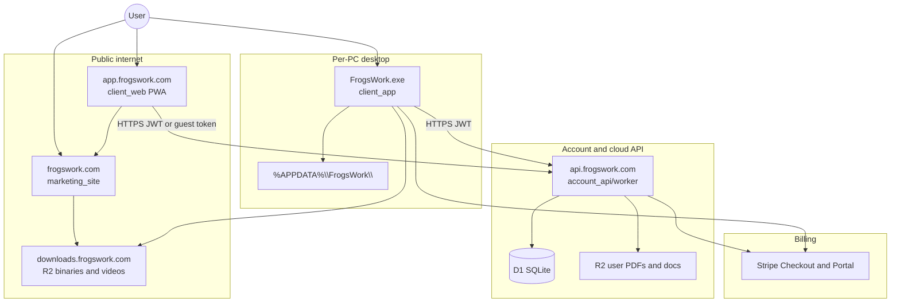
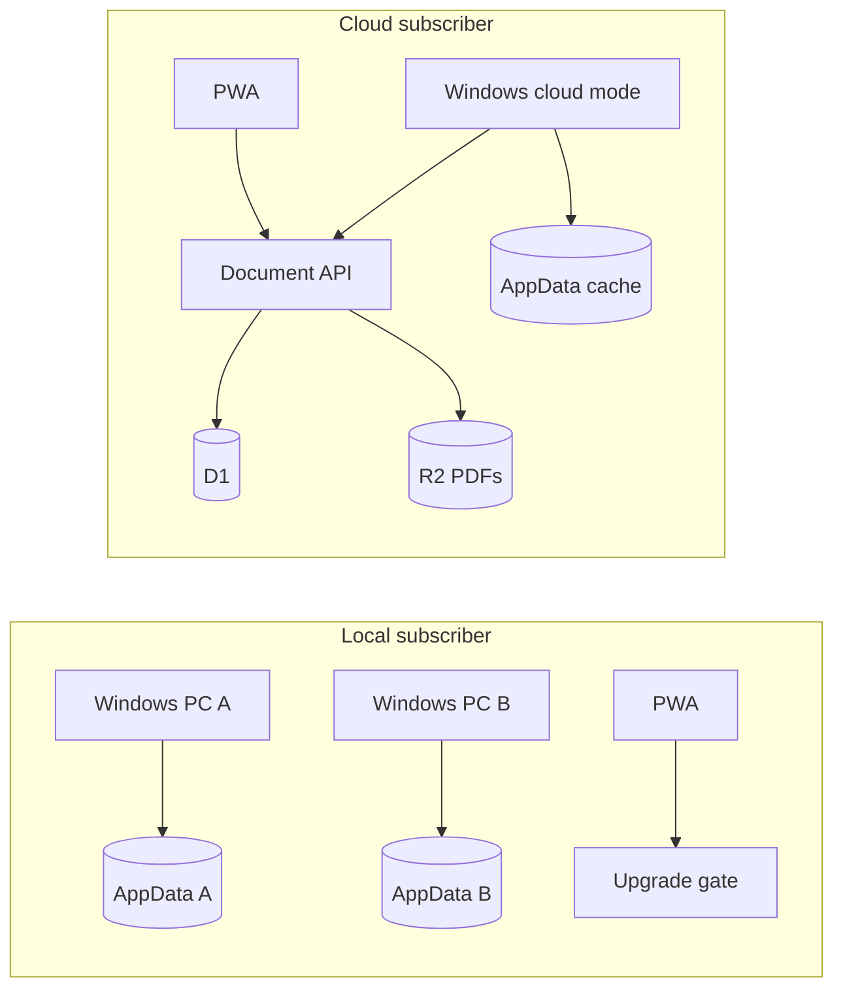
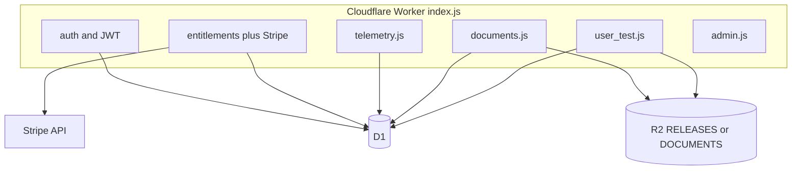
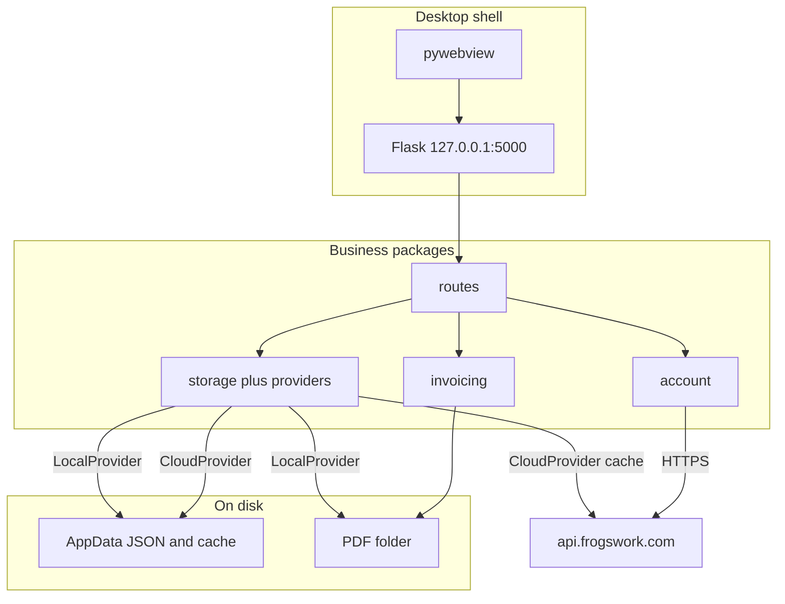
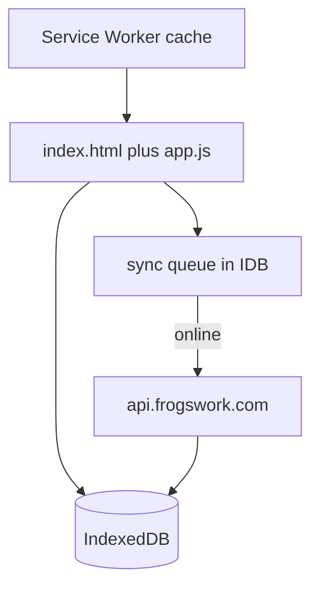
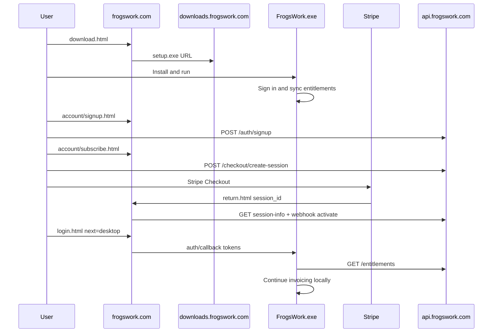
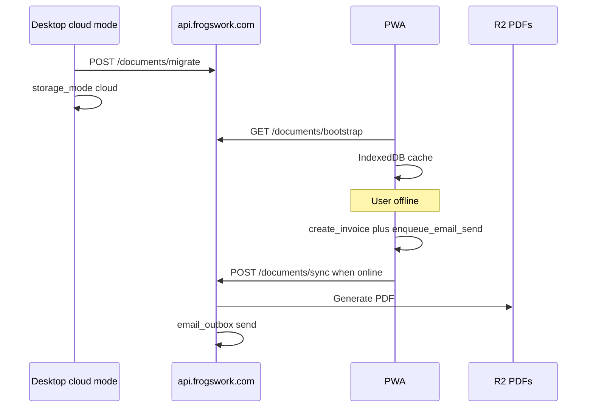

# FrogsWork platform architecture

How the monorepo segments fit together: what each part does, where it runs, and how they couple.

**Related docs:** [DEPLOY.md](DEPLOY.md) · [DOCUMENT-SCHEMA.md](DOCUMENT-SCHEMA.md) · [client_app/ARCHITECTURE.md](../client_app/ARCHITECTURE.md) · [account_api/ROUTES.md](../account_api/ROUTES.md)

---

## At a glance



| Segment | Folder | Host (prod) | Primary role |
|---------|--------|-------------|--------------|
| **Marketing site** | [`marketing_site/`](../marketing_site/) | `frogswork.com` | Acquisition, pricing, download, guides, legal |
| **Account API** | [`account_api/`](../account_api/) | `api.frogswork.com` | Auth, billing, entitlements, cloud documents, telemetry |
| **Windows desktop** | [`client_app/`](../client_app/) | User's PC (local) | Full invoicing app, Local or Cloud storage mode |
| **Mobile PWA** | [`client_web/`](../client_web/) | `app.frogswork.com` | Cloud-tier mobile, offline cache + sync queue |
| **Release assets** | R2 bucket | `downloads.frogswork.com` | Installers, update zips, marketing videos |
| **Dev API** | [`account_api/dev/`](../account_api/dev/) | `127.0.0.1:8787` | Local Flask mirror of Worker routes |

---

## Product model: two storage tiers

Both tiers share the **same account** (email + password) and **same API** for auth and billing. What differs is **where invoice data lives** and **which clients work fully**.

| Tier | Data location | Desktop | Mobile PWA |
|------|---------------|---------|------------|
| **Local** (lower price) | `%APPDATA%\FrogsWork\` per machine — **not synced** between PCs | Full app | Signed-in + active subscription (Cloud upgrade gate if Local deferred) |
| **Cloud** (higher price) | API → D1 metadata + R2 PDFs — **one dataset** everywhere | Full app + cloud sync | Full app + offline queue |



**Cross-device on Local tier:** Settings → Backup ZIP export/import, or upgrade to Cloud + migrate wizard.

**Not supported:** shared NAS/Dropbox PDF folder as sync (invoice records stay in AppData; PDF folder is files-only).

---

## 1. Marketing site

**Path:** [`marketing_site/`](../marketing_site/)  
**Runtime:** Static HTML/CSS/JS, deployed via Cloudflare Worker (`wrangler deploy`).  
**URL:** https://frogswork.com

### Features

| Area | Pages / assets | Purpose |
|------|----------------|---------|
| Acquisition | `index.html` | Product overview |
| Pricing | `pricing.html` | Plans (checkout happens in desktop app or Stripe links) |
| Download | `download.html` + [`releases.json`](../marketing_site/releases.json) | Latest Windows installer URL |
| Guides | `guides.html` + [`videos.json`](../marketing_site/videos.json) | Tutorial videos (R2-hosted) |
| Support | `support.html`, `issues.html`, `contact.html` | Help and contact |
| Legal | `privacy.html`, `terms.html` | Policy pages |
| User testing | `user-test.html` (unlisted) | Remote UX test intake → Account API |

### Architecture

- **No backend logic** — pure static files at site root.
- **No user data** — does not store invoices or accounts.
- **Release manifest** — `releases.json` points at R2 URLs for `setup.exe` and update zip (updated when you ship a release).
- **Videos** — metadata in `videos.json`; files on `downloads.frogswork.com/videos/`.

### Coupling

| Couples to | Direction | What |
|------------|-----------|------|
| **R2 / downloads** | Read | Installer, zip, video URLs in JSON manifests |
| **Account API** | Read (browser) | `user-test.html` calls `/user-test/*` with CORS from `frogswork.com` |
| **Windows app** | Indirect | User downloads installer; app opens Stripe return URL in dev; prod may use marketing redirect |
| **PWA** | Link out | Upgrade/pricing links to `pricing.html` |

**Does not couple to:** desktop AppData, D1 document tables, or invoice CRUD.

---

## 2. Account API (backend)

**Path:** [`account_api/`](../account_api/)  
**Production:** Cloudflare Worker — [`account_api/worker/`](../account_api/worker/)  
**Development:** Flask — [`account_api/dev/server.py`](../account_api/dev/server.py) on port 8787  
**URL:** https://api.frogswork.com  
**Contract:** [`account_api/ROUTES.md`](../account_api/ROUTES.md)

### Feature areas

| Area | Routes (examples) | Storage |
|------|-------------------|---------|
| **Health** | `GET /health` | — |
| **Auth** | `/auth/login`, `/register`, `/refresh`, `/attach-checkout` | D1 `users` |
| **Billing** | `GET /entitlements`, Stripe webhook ack | D1 + live Stripe query |
| **Checkout helper** | `GET /checkout/session-info` | Stripe |
| **Telemetry** | `/telemetry/heartbeat`, `/telemetry/event` | D1 `installs` |
| **Releases** | `GET /releases/latest` | Worker env vars → R2 zip URL |
| **Cloud documents** | `/documents/bootstrap`, `/migrate`, `/sync`, invoice PDF/send | D1 `doc_*` + R2 `user-docs/` |
| **Email outbox** | Chained from `/documents/invoices/:n/send` | D1 `email_outbox` → Resend (optional) |
| **Guest trial** | `POST /guest/session` | D1 `guest_workspaces` |
| **Admin** | `/admin`, `/admin/api/summary`, user-test admin | D1 |
| **User test** | `/user-test/status`, submissions, complete | D1 + R2 |

### Architecture



- **D1** — users, installs (telemetry aggregates), cloud document rows, email queue, guest workspaces.
- **R2** — release binaries (existing bucket), user invoice PDFs under `user-docs/{user_id}/`, user-test videos.
- **Stripe** — subscriptions; `storage_tier` derived from price metadata (`local` vs `cloud`).
- **JWT** — access (12 h) and refresh (30 d) for desktop and PWA; separate guest tokens for trial.

### Coupling

| Client | Calls API for | Never sends |
|--------|---------------|-------------|
| **Windows app** | Login, entitlements, telemetry, document sync (cloud mode), integrated email, updates | Full AppData on every request (only migrate/sync payloads) |
| **PWA** | Guest session, entitlements, document bootstrap/sync, email queue | — |
| **Marketing site** | User-test endpoints only | Invoice data |
| **Stripe** | Webhook POST (ack); entitlements polled live | — |

**Source of truth:**

- **Accounts / billing** — API + Stripe.
- **Cloud invoice data** — API (D1 + R2).
- **Local tier invoice data** — desktop AppData only (API sees telemetry counts, not line items).

---

## 3. Windows desktop app

**Path:** [`client_app/`](../client_app/)  
**Runtime:** Python 3, Flask (localhost:5000), pywebview window, PyInstaller → `FrogsWork.exe`  
**Deep dive:** [`client_app/ARCHITECTURE.md`](../client_app/ARCHITECTURE.md)

### Features

| Area | Modules | Notes |
|------|---------|-------|
| **Invoicing** | `routes/invoices_*`, `invoicing/` | Create, preview, PDF (ReportLab), past invoices, status |
| **Customers** | `routes/customers.py` | CRUD, structured AU addresses |
| **Business profiles** | `routes/businesses.py`, `storage/businesses.py` | Multiple “invoice from” entities, per-business numbering |
| **Settings** | `routes/settings.py` | Business details, PDF folder, account, updates, cloud migrate |
| **Entitlements** | `account/entitlement_guard.py` | Signed-in + active Stripe subscription (`active` / `trialing`); offline grace |
| **Subscription** | Web signup + subscribe + `account/client.py` | Local/Cloud Checkout Sessions on frogswork.com; entitlement cache + offline grace |
| **Backup** | `app_platform/backup.py` | ZIP export/import |
| **Updates** | `app_platform/updates.py` | Polls `GET /releases/latest` |
| **Integrated email** | `routes/invoices_manage.py` | Queue send via API (Local uploads PDF; Cloud chains server PDF) |
| **Cloud mode** | `storage/providers/cloud.py`, `storage/sync_queue.py` | Optional when Cloud tier + `storage_mode: cloud` |

### Architecture



### Storage modes

| Mode | When | Read/write |
|------|------|------------|
| **Local** | Default; Local tier only | `LocalProvider` → JSON in AppData + ReportLab PDFs on disk |
| **Cloud** | Cloud tier + user switched in migrate wizard | `CloudProvider` → API primary; AppData `cloud_cache/` + `sync_queue.json` for offline |

`storage/context.py` picks the active provider; `load_*` / `save_*` in storage modules delegate when cloud mode is on.

### Coupling

| Partner | Coupling |
|---------|----------|
| **Account API** | Required for subscribe, login, entitlements, telemetry; optional for cloud sync and email |
| **Marketing site** | Brand URLs, support links; user may download installer from frogswork.com |
| **R2** | In-app update zip only (via API metadata) |
| **PWA** | No direct link — shared data only if user is on **Cloud** tier (same API dataset) |
| **Stripe** | Payment Links on frogswork.com; return URL `/account/return.html`; desktop/PWA sign-in via web token handoff |

**Isolation:** Local tier PCs do **not** share data with each other or with mobile unless user migrates to Cloud.

---

## 4. Mobile PWA

**Path:** [`client_web/`](../client_web/)  
**Runtime:** Static SPA + Service Worker + IndexedDB  
**URL:** https://app.frogswork.com

### Features

| Feature | Implementation |
|---------|----------------|
| **Guest cloud trial** | `POST /guest/session` → guest JWT |
| **Cloud subscriber app** | JWT from desktop login (token in localStorage) + `GET /entitlements` |
| **Local tier gate** | Blocks full app; links to pricing |
| **Offline cache** | IndexedDB: businesses, customers, invoices, settings |
| **Sync queue** | FIFO mutations replayed via `POST /documents/sync` |
| **Offline UI** | Invoice list, customer/business tabs (read cached; write queues) |
| **Server PDFs** | No on-device PDF — `pdf_status: pending` until API generates |

### Architecture



### Coupling

| Partner | Coupling |
|---------|----------|
| **Account API** | **Hard dependency** for all cloud data and auth |
| **Marketing site** | Pricing/upgrade links only |
| **Windows app** | Shared Cloud dataset via API; no peer-to-peer sync |
| **Desktop Local tier** | No shared data — PWA shows upgrade gate |

**Does not couple to:** desktop AppData, ReportLab, or pywebview.

---

## 5. Release hosting (R2)

**Bucket:** `frogswork-invoicer-releases` (binding `RELEASES` on API Worker)  
**URL:** https://downloads.frogswork.com

| Prefix / file | Used by |
|---------------|---------|
| `FrogsWork-*-setup.exe` | Marketing `download.html` via `releases.json` |
| `FrogsWork-*-win64.zip` | Desktop in-app updater via `GET /releases/latest` |
| `videos/*` | Marketing `guides.html` |
| `user-tests/*` | User-test video uploads |
| `user-docs/{user_id}/invoices/*` | Cloud invoice PDFs (document API) |

Coupling is **URL-only** — consumers fetch by HTTPS; no shared code.

---

## 6. Shared contracts (coupling surface)

These are the **stable boundaries** between segments. Change them carefully across all clients.

| Contract | Doc | Consumers |
|----------|-----|-----------|
| **HTTP API** | [`account_api/ROUTES.md`](../account_api/ROUTES.md) | Desktop `account/client.py`, PWA `js/api.js`, marketing user-test |
| **Document entities** | [DOCUMENT-SCHEMA.md](DOCUMENT-SCHEMA.md) | Desktop storage, API `documents.js`, PWA IndexedDB |
| **Entitlements shape** | ROUTES.md + `storage_tier`, `platforms` | Desktop cache, PWA gate |
| **Sync mutations** | DOCUMENT-SCHEMA.md | Desktop `sync_queue.py`, PWA `sync.js`, API `documents.js` |
| **Backup ZIP layout** | Desktop `backup.py` | Cloud migrate endpoint |
| **Brand / URLs** | `client_app/app_config.py`, marketing HTML | All UIs |

---

## 7. Data flow examples

### New user: download → subscribe → invoice (Local tier)



### Cloud user: desktop migrate → mobile offline create



---

## 8. What each segment does *not* do

| Segment | Out of scope |
|---------|----------------|
| **Marketing** | Invoicing, auth UI, document storage |
| **Account API** | Render PDFs with ReportLab parity (stub/minimal PDF today); desktop UI |
| **Windows app** | Host public multi-user service; mobile-native app |
| **PWA** | Local-tier full app; on-device PDF generation |
| **R2** | Application logic |

---

## 9. Local development topology

```powershell
.\scripts\start-dev.ps1 -DevBrowser
```

| Process | Port | Folder |
|---------|------|--------|
| Account API (Flask) | 8787 | `account_api/dev/` |
| Desktop app (Flask) | 5000 | `client_app/` |
| Marketing (optional) | 8088 | `python -m http.server` in `marketing_site/` |
| PWA (optional) | 8090 | static server in `client_web/` |

Desktop defaults `FROGSWORK_ACCOUNT_API_URL` to `http://127.0.0.1:8787`. PWA can set `localStorage.frogswork_api` for the same.

---

## 9. Cloud data storage and encryption

| Data | Store | Format |
|------|-------|--------|
| Accounts | D1 `users` | bcrypt password hash, email, Stripe ID, tier |
| Cloud documents | D1 `doc_*` tables | Plain JSON per entity |
| Guest trial | D1 `guest_workspaces` | Plain JSON, 30-day TTL |
| Invoice PDFs | R2 `user-docs/{user_id}/invoices/{key}.pdf` | Raw PDF bytes |
| Email queue | D1 `email_outbox` | Metadata only |

**Encryption at rest:** Passwords are hashed (bcrypt). Cloud business JSON and PDFs rely on Cloudflare platform storage plus API access control (JWT, per-user SQL scope). There is no application-level field encryption of invoice or customer payloads. Desktop auth tokens in `account_auth.json` are Fernet-encrypted locally. All client↔API traffic uses HTTPS.

---

## 10. Future: macOS desktop

Deferred. Will mirror Windows dual-mode (Local AppData vs Cloud API) with platform glue in `app_platform/`. See [MACOS-DESKTOP.md](MACOS-DESKTOP.md).

---

## Quick reference: folder → deploy target

```
GrandparentsInvoicer/
├── marketing_site/     → frogswork.com
├── account_api/
│   ├── dev/            → 127.0.0.1:8787 (dev only)
│   └── worker/         → api.frogswork.com
├── client_app/         → FrogsWork.exe (user PC)
├── client_web/         → app.frogswork.com
├── scripts/            → release and dev orchestration
└── docs/               → operator documentation (this file)
```
