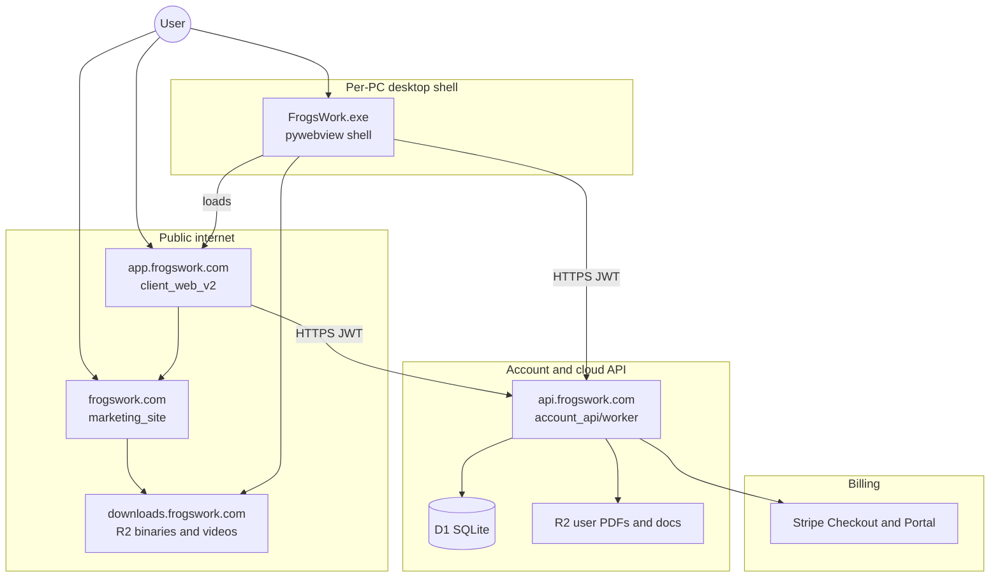
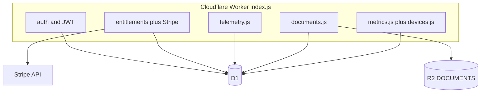
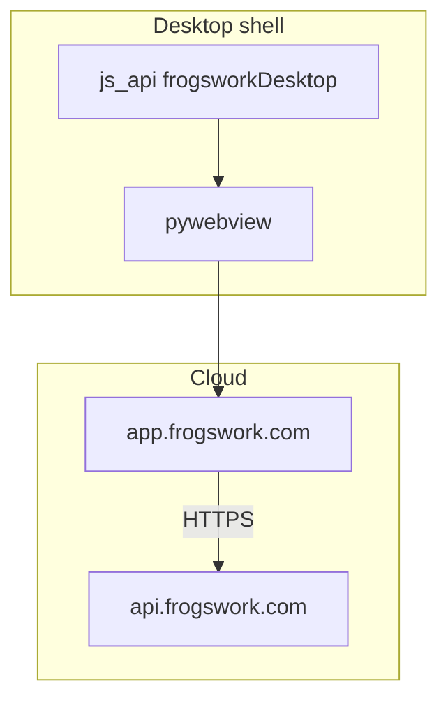
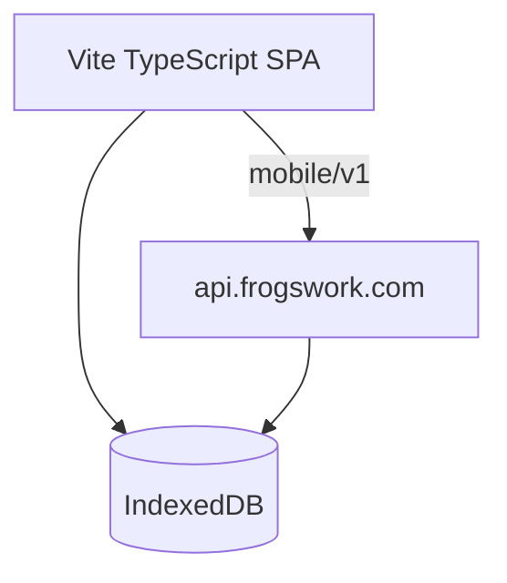
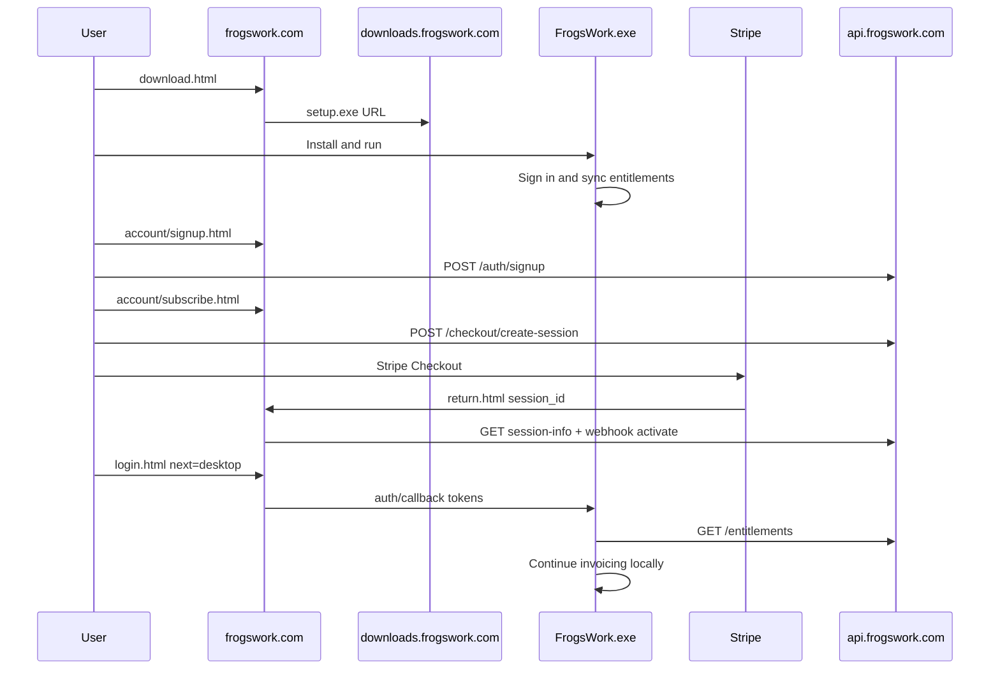
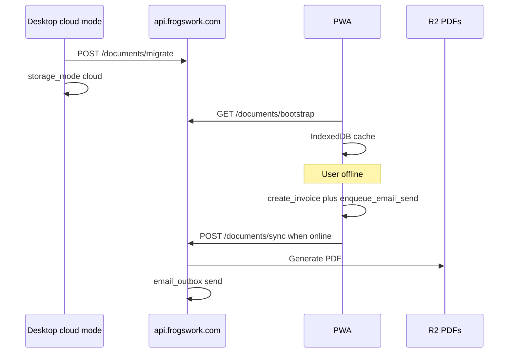

# FrogsWork platform architecture

How the monorepo segments fit together: what each part does, where it runs, and how they couple.

**Related docs:** [DEPLOY.md](DEPLOY.md) · [DOCUMENT-SCHEMA.md](DOCUMENT-SCHEMA.md) · [client_app/ARCHITECTURE.md](../client_app/ARCHITECTURE.md) · [account_api/ROUTES.md](../account_api/ROUTES.md)

---

## At a glance



| Segment | Folder | Host (prod) | Primary role |
|---------|--------|-------------|--------------|
| **Marketing site** | [`marketing_site/`](../marketing_site/) | `frogswork.com` | Acquisition, pricing, download, guides, legal |
| **Account API** | [`account_api/`](../account_api/) | `api.frogswork.com` | Auth, billing, entitlements, cloud documents, telemetry |
| **Shared Cloud UI** | [`client_web_v2/`](../client_web_v2/) | `app.frogswork.com` | Invoicing UI for browser, PWA, and desktop shell |
| **Windows desktop shell** | [`client_app/`](../client_app/) | User's PC | pywebview host + splash, updater, Inno installer |
| **Release assets** | R2 bucket | `downloads.frogswork.com` | Cloud shell installers and update zips |
| **Dev API** | [`account_api/dev/`](../account_api/dev/) | `127.0.0.1:8787` | Local Flask mirror of Worker routes |

---

## Product model: Cloud first (Local deferred)

The shipping product is **Cloud-only**: one dataset on the API (D1 + R2), used from browser, phone PWA, and the Windows shell.

| Host | Data | Notes |
|------|------|-------|
| Browser / PWA | Cloud API + IndexedDB offline queue | Same build |
| Windows shell | Same Cloud API | Native window; `window.frogsworkDesktop` host flag |

### Local SKU decision gate (deferred)

A Local plan (data on this PC, not offline-first Cloud) is **out of scope** until we re-evaluate after Cloud hosts are stable. Decide later based on:

1. **Demand** — do subscribers ask for data-on-PC without cloud documents?
2. **Limitations** — WebView2 vs true offline Local; cost of a local document API matching Cloud routes; marketing/checkout complexity.

Options then: implement a Local sidecar with the same document API against AppData (and restore Local marketing), or drop Local permanently (optional Stripe Local price cleanup). Auth, Stripe, and Resend stay on the cloud API either way.

Until then: no Local pricing cards, no Local-only installer messaging, and Local-tier accounts see the Cloud upgrade screen in the shared UI.
---

## 1. Marketing site

**Path:** [`marketing_site/`](../marketing_site/)  
**Runtime:** Static HTML/CSS/JS, deployed via Cloudflare Worker (`wrangler deploy`).  
**URL:** https://frogswork.com

### Features

| Area | Pages / assets | Purpose |
|------|----------------|---------|
| Acquisition | `index.html` | Product overview |
| Pricing | `pricing.html` | Plans (checkout happens in desktop app or Stripe links) |
| Download | `download.html` + [`releases.json`](../marketing_site/releases.json) | Latest Windows installer URL |
| Guides | `guides.html` + [`videos.json`](../marketing_site/videos.json) | Tutorial videos (R2-hosted) |
| Support | `support.html`, `issues.html`, `contact.html` | Help and contact |
| Legal | `privacy.html`, `terms.html` | Policy pages |

### Architecture

- **No backend logic** — pure static files at site root.
- **No user data** — does not store invoices or accounts.
- **GA4 (marketing)** — optional Measurement ID in `js/analytics-config.js`.
- **Release manifest** — `releases.json` points at R2 URLs for `setup.exe` and update zip (updated when you ship a release).
- **Videos** — metadata in `videos.json`; files on `downloads.frogswork.com/videos/`.

### Coupling

| Couples to | Direction | What |
|------------|-----------|------|
| **R2 / downloads** | Read | Installer, zip, video URLs in JSON manifests |
| **Account API** | Write (browser) | Account signup/checkout pages call `/auth/*` and `/checkout/*` |
| **Windows app** | Indirect | User downloads installer; app opens Stripe return URL in dev; prod may use marketing redirect |
| **PWA** | Link out | Upgrade/pricing links to `pricing.html` |

**Does not couple to:** desktop AppData, D1 document tables, or invoice CRUD.

---

## 2. Account API (backend)

**Path:** [`account_api/`](../account_api/)  
**Production:** Cloudflare Worker — [`account_api/worker/`](../account_api/worker/)  
**Development:** Flask — [`account_api/dev/server.py`](../account_api/dev/server.py) on port 8787  
**URL:** https://api.frogswork.com  
**Contract:** [`account_api/ROUTES.md`](../account_api/ROUTES.md)

### Feature areas

| Area | Routes (examples) | Storage |
|------|-------------------|---------|
| **Health** | `GET /health` | — |
| **Auth** | `/auth/login`, `/register`, `/refresh`, `/attach-checkout` | D1 `users` |
| **Billing** | `GET /entitlements`, Stripe webhook ack | D1 + live Stripe query |
| **Checkout helper** | `GET /checkout/session-info` | Stripe |
| **Telemetry** | `/telemetry/heartbeat`, `/telemetry/event` | D1 `installs` |
| **Metrics** | `GET /metrics/summary`, `POST /devices/upsert` | D1 aggregates + `account_devices` |
| **Releases** | `GET /releases/latest` | Worker env vars → R2 zip URL |
| **Cloud documents** | `/documents/bootstrap`, `/migrate`, `/sync`, invoice PDF/send | D1 `doc_*` + R2 `user-docs/` |
| **Email outbox** | Chained from `/documents/invoices/:n/send` | D1 `email_outbox` → Resend (optional) |
| **Guest trial** | `POST /guest/session` | D1 `guest_workspaces` |

### Architecture



- **D1** — users, installs (legacy shell telemetry), cloud document rows, email queue, guest workspaces, account devices.
- **R2** — release binaries (`frogswork-invoicer-releases`), user invoice PDFs in `frogswork-user-docs` under `user-docs/{user_id}/`.
- **Stripe** — subscriptions; `storage_tier` derived from price metadata (`local` vs `cloud`).
- **Metrics** — `GET /metrics/summary` (Bearer `METRICS_TOKEN`) for local-only operator dashboard.- **JWT** — access (12 h) and refresh (30 d) for shell, browser, and PWA.

### Coupling

| Client | Calls API for | Never sends |
|--------|---------------|-------------|
| **Shared Cloud UI** | Login, entitlements, document sync, email queue | — |
| **Windows shell** | Telemetry heartbeat; updater polls `/releases/latest` | Invoice documents (from the Cloud UI) |
| **Marketing site** | Checkout session create | Invoice data |
| **Stripe** | Webhook POST (ack); entitlements polled live | — |

**Source of truth:**

- **Accounts / billing** — API + Stripe.
- **Invoice data** — API (D1 + R2). Local AppData is not the product store for this cut.

---

## 3. Windows desktop shell

**Path:** [`client_app/`](../client_app/)  
**Runtime:** Python 3, pywebview (WebView2), PyInstaller → `FrogsWork.exe`  
**Deep dive:** [`client_app/ARCHITECTURE.md`](../client_app/ARCHITECTURE.md)

### Features

| Area | Modules | Notes |
|------|---------|-------|
| **Cloud UI host** | `desktop_shell.py`, `app.py` | Loads `DESKTOP_APP_URL` (default `https://app.frogswork.com`) |
| **Host bridge** | `DesktopBridge` + `client_web_v2` `host.ts` | `window.frogsworkDesktop` (`apiBase`, `openExternal`) |
| **Splash / window** | `desktop_shell.py`, `window_state.py` | Brand splash, geometry persistence |
| **Updates** | `app_platform/updates.py` | Polls `GET /releases/latest` |
| **Uninstall** | `win/uninstall.py` | `--export-uninstall-data` for Inno |

### Architecture



### Coupling

| Partner | Coupling |
|---------|----------|
| **Cloud UI** | Shell navigates to Pages URL; injects host flag |
| **Account API** | UI uses JWT; shell may send install telemetry |
| **R2 downloads** | Update zip + setup.exe |
| **Marketing site** | Brand URLs; optional Windows shell download |

---

## 4. Shared Cloud UI (browser + PWA + shell)

**Path:** [`client_web_v2/`](../client_web_v2/)  
**Runtime:** Vite + TypeScript SPA with IndexedDB; online-first, no service worker
**URL:** https://app.frogswork.com

### Features

| Feature | Implementation |
|---------|----------------|
| **Subscriber app** | In-app login or one-time web handoff; active subscription required |
| **Account state** | `GET /mobile/v1/account` |
| **Document bootstrap** | `GET /mobile/v1/bootstrap` cached in IndexedDB |
| **Document mutations** | `POST /mobile/v1/sync` |
| **Server PDFs** | `GET /mobile/v1/invoices/:id/pdf` |

### Architecture



### Coupling

| Partner | Coupling |
|---------|----------|
| **Account API** | **Hard dependency** for all cloud data and auth |
| **Marketing site** | Pricing/upgrade links only |
| **Windows app** | Shared Cloud dataset via API; no peer-to-peer sync |
| **Desktop app** | Uses the same account and Cloud dataset |

**Does not couple to:** desktop AppData, ReportLab, or pywebview.

---

## 5. Release hosting (R2)

**Bucket:** `frogswork-invoicer-releases` (binding `RELEASES` on API Worker)  
**URL:** https://downloads.frogswork.com

| Prefix / file | Used by |
|---------------|---------|
| `FrogsWork-*-setup.exe` | Marketing `download.html` via `releases.json` |
| `FrogsWork-*-win64.zip` | Desktop in-app updater via `GET /releases/latest` |
| `videos/*` | Marketing `guides.html` |
| `user-docs/{user_id}/*` | Cloud invoice PDFs |

**Documents bucket:** `frogswork-user-docs` (binding `DOCUMENTS` on API Worker). Private — no public downloads hostname.

| Prefix / file | Used by |
|---------------|---------|
| `user-docs/{user_id}/invoices/*` | Cloud invoice PDFs (document API) |

Coupling for releases is **URL-only** — consumers fetch by HTTPS; no shared code. Invoice PDFs are served only through the API Worker (JWT-scoped).

---

## 6. Shared contracts (coupling surface)

These are the **stable boundaries** between segments. Change them carefully across all clients.

| Contract | Doc | Consumers |
|----------|-----|-----------|
| **HTTP API** | [`account_api/ROUTES.md`](../account_api/ROUTES.md) | Desktop `account/client.py`, Cloud UI sync, marketing account pages |
| **Document entities** | [DOCUMENT-SCHEMA.md](DOCUMENT-SCHEMA.md) | Desktop storage, API `documents.js`, PWA IndexedDB |
| **Entitlements shape** | ROUTES.md + `storage_tier`, `platforms` | Desktop cache, PWA gate |
| **Sync mutations** | DOCUMENT-SCHEMA.md | Desktop `sync_queue.py`, PWA `sync.js`, API `documents.js` |
| **Backup ZIP layout** | Desktop `backup.py` | Cloud migrate endpoint |
| **Brand / URLs** | `client_app/app_config.py`, marketing HTML | All UIs |

---

## 7. Data flow examples

### New user: download → subscribe → invoice (Local tier)



### Cloud user: desktop migrate → mobile offline create



---

## 8. What each segment does *not* do

| Segment | Out of scope |
|---------|----------------|
| **Marketing** | Invoicing, auth UI, document storage |
| **Account API** | Render PDFs with ReportLab parity (stub/minimal PDF today); desktop UI |
| **Windows app** | Host public multi-user service; mobile-native app |
| **PWA** | Local-tier full app; on-device PDF generation |
| **R2** | Application logic |

---

## 9. Local development topology

```powershell
.\scripts\start-dev.ps1 -DevBrowser
```

| Process | Port | Folder |
|---------|------|--------|
| Account API (Flask) | 8787 | `account_api/dev/` |
| Desktop app (Flask) | 5000 | `client_app/` |
| Marketing (optional) | 8088 | `python -m http.server` in `marketing_site/` |
| Cloud app (optional) | 8090 | Vite dev server in `client_web_v2/` |

Desktop defaults `FROGSWORK_ACCOUNT_API_URL` to `http://127.0.0.1:8787`. The cloud app can set `localStorage.frogswork_api` to the same URL.

---

## 9. Cloud data storage and encryption

| Data | Store | Format |
|------|-------|--------|
| Accounts | D1 `users` | bcrypt password hash, email, Stripe ID, tier |
| Cloud documents | D1 `doc_*` tables | Plain JSON per entity |
| Guest trial | D1 `guest_workspaces` | Plain JSON, 30-day TTL |
| Invoice PDFs | R2 bucket `frogswork-user-docs` (`user-docs/{user_id}/invoices/{key}.pdf`) | Raw PDF bytes |
| Email queue | D1 `email_outbox` | Metadata only |

**Encryption at rest:** Passwords are hashed (bcrypt). Cloud business JSON and PDFs rely on Cloudflare platform storage plus API access control (JWT, per-user SQL scope). There is no application-level field encryption of invoice or customer payloads. Desktop auth tokens in `account_auth.json` are Fernet-encrypted locally. All client↔API traffic uses HTTPS.

---

## 10. Future: macOS desktop

Deferred. Will mirror Windows dual-mode (Local AppData vs Cloud API) with platform glue in `app_platform/`. See [MACOS-DESKTOP.md](MACOS-DESKTOP.md).

---

## Quick reference: folder → deploy target

```
GrandparentsInvoicer/
├── marketing_site/     → frogswork.com
├── account_api/
│   ├── dev/            → 127.0.0.1:8787 (dev only)
│   └── worker/         → api.frogswork.com
├── client_app/         → FrogsWork.exe (user PC)
├── client_web_v2/      → app.frogswork.com
├── scripts/            → release and dev orchestration
└── docs/               → operator documentation (this file)
```
