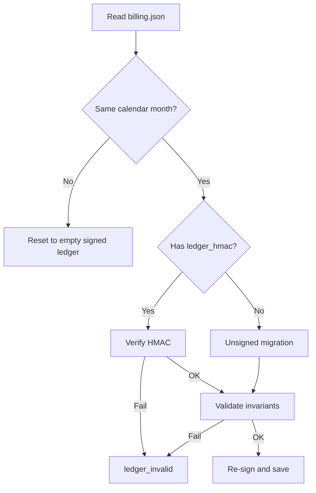

# Billing ledger operator guide

> **Deprecated (June 2026):** FrogsWork no longer uses a signed usage ledger. Trial limits and Stripe subscriptions replaced usage-based billing. See [billing-rules.md](billing-rules.md). This document is kept for support of legacy installs only.

Developers and operator/support: this document explains how the **signed offline usage ledger** worked in the old model.

Product billing rules: [billing-rules.md](billing-rules.md). Threat model and deployment: [security-risk-model.md](security-risk-model.md).

---

## Purpose

The desktop app must decide offline whether a user is still under the **$2,000/month ex-GST free tier**. That decision is stored locally in signed JSON files. This guide covers:

- What those files contain and how verification runs
- Innocent scenarios that can trigger a false “tamper” block
- Support recovery steps
- Product philosophy: prefer unblocking honest users over strict tamper detection

This is **not** end-user documentation, though recovery steps inform support replies.

---

## Files on disk

Location: `%APPDATA%\FrogsWork\` (see `storage.get_appdata_path()`).

| File | Role |
|------|------|
| `billing.json` | Usage ledger: `usage_month`, `total_ex_gst`, `events[]`, cap settings, `ledger_hmac` |
| `billing_install.json` | Per-install random secret created on first run; used to sign the ledger |

Both files are included in backup export (`client_routes.backup_export` writes all files from `get_data_path()`, which is the same AppData folder).

**Important:** The HMAC signature is **machine-specific**. Restoring `billing.json` from a backup without the matching `billing_install.json` from the same machine will fail verification.

---

## How verification works

Every time the app loads billing data (`billing_local.load_billing()` → `billing_ledger.prepare_ledger()`):



Implementation: [`client_app/billing_ledger.py`](../client_app/billing_ledger.py), [`client_app/billing_local.py`](../client_app/billing_local.py).

### Signing key

The HMAC key is derived from:

```
SHA256(install_secret + "frogswork-ledger-v1")
```

- `install_secret`: random 32-byte hex in `billing_install.json`
- Optional env override pepper: `FROGSWORK_LEDGER_PEPPER`

Each save of `billing.json` includes `ledger_hmac` over a canonical JSON payload (month, total, cap, events).

### Three verification layers

#### Layer 1: HMAC signature

Detects edits made outside the app (e.g. Notepad). If `ledger_hmac` is present and does not match the file contents, verification fails.

#### Layer 2: Internal consistency

From `validate_ledger_invariants()`:

- `total_ex_gst >= 0`
- `total_ex_gst` ≈ sum of `events[].amount_ex_gst` (within **$0.01**)
- No negative event amounts

#### Layer 3: Cross-check with invoices

If there is at least one invoice in the current calendar month, `total_ex_gst` must also ≈ the sum of `amount_ex_gst` from `invoices.json` for that month (within **$0.01**).

This catches resetting billing totals while invoice history remains, but it is also the main source of **false positives** (see below).

### Account gate (separate from tamper detection)

Even with a valid ledger, an account is required when `account_required_for()` returns true:

- Cap is enabled, OR
- **This invoice alone** exceeds $2,000 ex-GST, OR
- **Projected month total** (current + this invoice) exceeds $2,000 ex-GST

This closes the former negative-total exploit without relying only on the HMAC.

---

## What happens on failure

When checks fail and automatic repair cannot fix the issue:

1. `BillingIntegrityError` is caught in `load_billing()`
2. Data is returned with `_integrity_failed` set internally
3. `local_usage_snapshot()` exposes `ledger_invalid: True`
4. Preview and generate are blocked in `app.py` (`_billing_generate_guard`, `_billing_preview_template`)
5. User sees a message pointing to **Settings → Your account** to repair manually
6. Signup export fails (`export_events_for_signup()` raises) until repaired

### Automatic repair on load

Before marking a ledger invalid, the app attempts **silent repair** for offline users:

- Rebuilds `billing.json` from `invoices.json` for the current month
- Preserves cap settings from the existing file

This fixes most innocent mismatches (backup restore, crash mid-generate) without user action.

### Signed-in users (relaxed mode)

When authenticated, local billing is not authoritative: the server is. Load uses **relaxed mode**:

- Skips HMAC verification and invoice cross-check
- Resets to an empty local cache if core invariants fail

This avoids false positives from local/server drift.

### Manual repair (Settings → Your account)

If automatic repair fails, the user sees two buttons:

| Action | Effect |
|--------|--------|
| **Rebuild from invoices** | Same as automatic repair: match usage to invoice history |
| **Reset usage cache** | Clear local usage for this month (fresh $2k offline buffer) |

Route: `POST /account/repair-ledger` (`client_routes.account_repair_ledger`).

---

## Innocent false-positive scenarios

| Scenario | Symptom | Why it flags |
|----------|---------|--------------|
| Partial backup restore | Cross-check failure | `invoices.json` restored but `billing.json` (or vice versa) from different points in time |
| Restore on new PC | HMAC invalid | `billing.json` restored without matching `billing_install.json` from the same machine |
| Crash mid-generate | Cross-check failure | Billing is committed in `_billing_generate_guard` **before** PDF generation and `storage.add_invoice()`: a crash between those steps leaves billing ahead of invoices |
| Signed-in user + local drift | Cross-check failure when local billing loads | Authenticated commits go to the **server** (`billing_client.commit`); local `billing.json` is not updated per invoice, but cross-check still compares it to `invoices.json` |
| File corruption / cloud sync | Parse error or HMAC invalid | OneDrive/antivirus partial writes or merged conflict copies |
| Pre-upgrade inconsistent ledger | Fails on first load after update | Unsigned `billing.json` from before the security update fails migration validation if totals were already wrong |

### Generate order (relevant for crash scenario)

In `app.py` `generate()`:

1. `_billing_generate_guard()`: commits usage to billing (local or server)
2. `pdf_generator.generate_invoice()`
3. `storage.add_invoice()`

If the app dies after step 1 but before step 3, layer 3 cross-check can fail on next load. Note: cross-check is skipped when there are **zero** invoices for the month, so the first invoice of the month may not flag until a second one is attempted.

---

## Support recovery playbook

**Always close the app before editing AppData files.**

Path: `%APPDATA%\FrogsWork\`

### Option A: Reset (default for trusted users)

Simplest fix when you prefer usability over strict usage tracking.

1. Delete `billing.json`
2. Optionally delete `billing_install.json` (forces a new signing key)
3. Restart the app

**Effect:** Fresh signed ledger for the current month ($0 local usage). Invoices, customers, settings, and PDFs are untouched.

**Tradeoff:** User gets a fresh $2,000 offline buffer for the rest of the month unless they have a server account with authoritative usage.

### Option B: Rebuild from invoices (keeps usage honest)

Use when invoice records are correct but billing files are out of sync.

1. Open `invoices.json`
2. For each invoice whose `invoice_date` starts with the current `YYYY-MM`, note `invoice_number` and `amount_ex_gst`
3. Sum those amounts → `total_ex_gst`
4. Build `events[]` with one entry per invoice: `{ "invoice_number", "amount_ex_gst", "usage_month" }`
5. Edit `billing.json`:
   - Set `usage_month` to current month
   - Set `total_ex_gst` and `events` from steps 3–4
   - Remove `ledger_hmac` (or delete the file and write the rebuilt content)
6. **Keep the same** `billing_install.json` on this machine
7. Restart the app: unsigned migration validates invariants and re-signs

### Option C: Full pair restore

Restore **both** `billing.json` and `billing_install.json` from the **same backup** on the **same machine**. Partial restores are the most common cause of mismatches.

### Option D: Create account (after A or B)

Once signed in, the billing **server** is authoritative for usage commits. This sidesteps local ledger issues for future invoices.

**Note:** Signup calls `export_events_for_signup()`, which refuses if the ledger is already invalid. Usually apply Option A or B first, then have the user complete account creation.

---

## Product philosophy

**Prefer unblocking honest users over strict tamper detection.**

The ledger is **tamper-evident**, not tamper-proof. Casual Notepad edits are the target; a determined user can patch the `.exe` or rebuild files. See [security-risk-model.md](security-risk-model.md) for trust boundaries.

Current strict points:

| Mechanism | False-positive risk |
|-----------|---------------------|
| Cross-check vs `invoices.json` | Highest: backup/crash/auth drift |
| HMAC hard block | Restore on wrong machine |
| No repair UI | Support burden |

Possible future improvements:

- Advisory warn instead of block when cross-check fails (partially addressed by auto-repair on load)
- ~~In-app **“Reset usage cache”** or **“Rebuild from invoices”** in Settings → Your account~~ **Implemented**

**Recommended support default:** Option A (reset billing files) for edge cases auto-repair and the in-app buttons do not cover.

---

## Related docs

- [billing-rules.md](billing-rules.md): when account is required, free tier rules
- [security-risk-model.md](security-risk-model.md): threat model, deployment, known limitations
- [README.md](README.md): development overview
