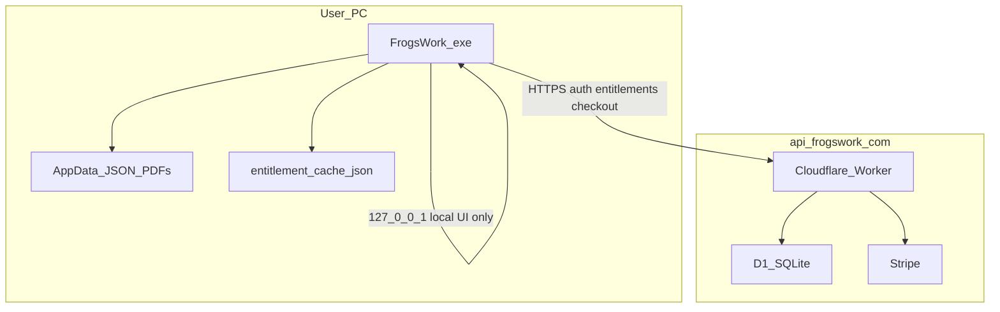

# Security and entitlement risk model

Developers and operators: trust boundaries, deployment, and offline integrity.

Product billing rules: [billing-rules.md](billing-rules.md). Stripe setup: [STRIPE_SETUP.md](STRIPE_SETUP.md).

---

## Architecture

### Connection policy

| Mode | Network | Authority |
|------|---------|-----------|
| Free trial (under limits) | **None** | Local `invoices.json` totals via `trial_stats` |
| Trial exceeded | **Required** for subscribe | Stripe Checkout via Worker |
| Subscribed | Periodic verify | Worker `GET /entitlements` cached locally |
| Subscribed offline | Grace period | `entitlement_cache.json` with 14-day hard block |

Code paths:

- Trial gate: `entitlement_guard.check_generate_access()` → `trial_stats.meter_snapshot()`
- Subscription verify: `account_sync.sync_entitlements_from_server()` → `entitlement_cache`
- Account API URL: `app_config.DEFAULT_ACCOUNT_API_URL` / stored auth URL

---

## Production deployment

1. **Account API** on Cloudflare Worker (`api.frogswork.com`) with D1 database
2. **Stripe webhooks** to Worker for subscription lifecycle
3. **Secrets** in Wrangler secrets: `STRIPE_SECRET_KEY`, `STRIPE_WEBHOOK_SECRET`, `JWT_SECRET`
4. **Desktop releases** built with production API URL; users do not configure the server URL

### Production checklist

| Item | Dev | Production |
|------|-----|------------|
| Unique `JWT_SECRET` | Optional (known dev secret OK) | **Required** |
| HTTPS to account API | No (localhost) | **Yes** (Cloudflare) |
| Stripe webhook signing secret | Test mode secret | Live mode secret |
| Password min length (8) | Enforced | Enforced |
| Per-machine `FLASK_SECRET_KEY` | Auto-generated in AppData | Auto-generated in AppData |
| CSRF on localhost Flask | Low priority | Low priority (single-user local UI) |

---

## Entitlement integrity

### Free trial

Trial limits derive from local `invoices.json` (invoice count and ex-GST totals). No signed ledger; totals are recomputed on each generate check.

**Protections:**

1. Invoice data is local JSON; user can edit files, but trial is a product limit not a security boundary
2. Generate is blocked when limits exceeded until account + subscription

### Subscribed access

Subscription status is cached in `%APPDATA%\FrogsWork\entitlement_cache.json` after successful `GET /entitlements`.

**Offline grace** (see [billing-rules.md](billing-rules.md)):

| Days since last verify | Behaviour |
|------------------------|-----------|
| 0–6 | Full access |
| 7–13 | Soft reminder banner |
| 14+ | Generate blocked until online verify |

**Known limitations:**

| Risk | Mitigation | Residual |
|------|------------|----------|
| User edits entitlement cache | Re-verified on next online check | Determined attacker could patch running app |
| JWT / refresh token theft | HTTPS in production; short access token TTL | Stolen refresh token works until expiry |
| Weak token encryption | Per-install random key in `install_secret.py` | Secret still on same machine as app |

---

## Desktop app trust boundary

The desktop app runs locally on the user's PC. The user can always:

- Edit AppData JSON files
- Patch the `.exe`
- Run modified code

**Goal:** Casual users cannot bypass subscription without paying. Trial limits are enforced locally; subscribed status requires server verification with offline grace.

Sales invoice data (customers, PDFs, line items) never leaves the PC except via optional backup ZIP or email send initiated by the user.

---

## Account API trust boundary

Authoritative for:

- Account credentials (bcrypt password hashes)
- Stripe customer and subscription linkage
- Entitlement status returned to desktop

---

## Related docs

- [billing-rules.md](billing-rules.md): product rules
- [STRIPE_SETUP.md](STRIPE_SETUP.md): Stripe Dashboard and webhooks
- [DEPLOY.md](DEPLOY.md): Worker deploy
- [README.md](README.md): development overview
