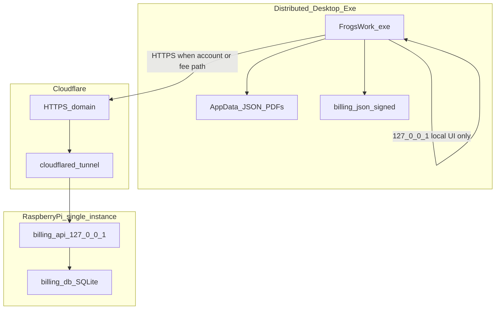

# Security & billing integrity risk model

Developers and operators: this document describes trust boundaries, known risks, production deployment on a single Raspberry Pi, and how offline billing integrity is enforced.

Product billing rules live in [billing-rules.md](billing-rules.md). This document covers **security assumptions and mitigations**.

---

## Architecture



### Connection policy

| Mode | Network to billing server | Authority |
|------|---------------------------|-----------|
| Offline, no account, under $2k, no cap | **None** | Signed local ledger (`billing.json`) |
| Single invoice over $2k, month over $2k, cap on, or signed in | **Required**: HTTPS to production URL | Server (`/usage/preview`, `/usage/commit`) |
| After account creation | Server for commits | Server |

Code paths:

- Offline: `billing_client.commit` → `billing_local.record_local_commit` (when `server_required` is false)
- Online: same module when `billing_auth_store.is_authenticated()`
- Build-time URL: `app_config.DEFAULT_BILLING_SERVER_URL` / `build_client.ps1 -BillingUrl`

---

## Production deployment (Raspberry Pi)

Intended production stack:

1. **Single billing instance** on Raspberry Pi (systemd autorestart; UPS recommended)
2. **Cloudflare Tunnel**: public HTTPS on your domain; do not expose the billing port on the WAN
3. Billing API binds **`127.0.0.1:8008`** on the Pi (`PORT=8008` in production; dev uses 8080); only `cloudflared` connects locally
4. **TLS** terminates at Cloudflare
5. **Secrets:** unique `JWT_SECRET` in a root-only env file on the Pi: never in repo or dev scripts for production
6. **Distributed `.exe`:** built with production `https://api.frogswork.com`; users do not configure the server URL in normal flow

### Production checklist

| Item | Dev | Production |
|------|-----|------------|
| Unique `JWT_SECRET` | Optional (known dev secret OK) | **Required** |
| HTTPS to billing API | No (localhost) | **Yes** (Cloudflare) |
| Bind billing to localhost | Optional | **Yes** |
| Bind `0.0.0.0` on WAN | N/A | **No** |
| Rate limiting on `/auth/*` | Optional | **Recommended** (Cloudflare + app-level) |
| Password min length (8) | Enforced | Enforced |
| Per-machine `FLASK_SECRET_KEY` | Auto-generated in AppData | Auto-generated in AppData |
| Offline free-tier tamper | HMAC-signed ledger | HMAC-signed ledger |
| CSRF on localhost Flask | Low priority | Low priority (single-user local UI) |

---

## Billing integrity

### Offline free tier

Local usage is stored in `%APPDATA%\FrogsWork\billing.json` (see `storage.get_appdata_path()`).

**Implemented protections** (`client_app/billing_ledger.py`):

1. **HMAC signature**: each save includes `ledger_hmac` keyed by a per-install secret in `billing_install.json`
2. **Invariant checks on load**: `total_ex_gst >= 0`; event sum matches total; cross-check against `invoices.json` for the current month when invoices exist
3. **Account gate**: account required if **this invoice** exceeds $2k ex-GST **or** projected month total exceeds $2k **or** cap is enabled
4. **Corrupt ledger**: `BillingIntegrityError` / `ledger_invalid` blocks preview and generate with a user-facing message

For a detailed walkthrough, false-positive scenarios, and support recovery steps, see [billing-ledger-guide.md](billing-ledger-guide.md).

Signup sends signed `initial_usage` to the server; the server rejects unsigned or inconsistent history (`billing_server/auth_service.validate_initial_usage`).

### Known limitations (honest)

| Risk | Mitigation | Residual |
|------|------------|----------|
| User edits `billing.json` in Notepad | HMAC + invariants | Determined attacker with debugger could patch the running app |
| User deletes ledger and keeps invoices | Cross-check fails → blocked until support/reset | See [billing-ledger-guide.md](billing-ledger-guide.md) recovery playbook |
| Fake `initial_usage` at signup | Server validates totals and requires `ledger_hmac` | Client could still forge HMAC if install secret is extracted |
| JWT / refresh token theft | HTTPS in production; short access token TTL | Stolen refresh token works until expiry |
| Password in Flask session during signup | **Fixed**: password only on final signup step | N/A |
| Weak token encryption (COMPUTERNAME+USERNAME) | **Fixed**: per-install random key | Secret still on same machine as app |
| Default JWT / Flask secrets in dev | Env override in production; desktop generates Flask secret | Dev builds use known defaults |
| Billing server on `0.0.0.0` | **Fixed**: default `127.0.0.1` | Must set behind tunnel on Pi |
| No auth rate limiting | **Fixed**: in-memory limit on register/login | Use Cloudflare rules for production |
| Settings page probes `/health` when offline | **Fixed**: probe only when signed in | N/A |

### Former exploit: negative `total_ex_gst`

**Before:** Setting `"total_ex_gst": "-50000"` allowed a single invoice over $2k offline without an account.

**After:** Negative totals fail validation; single invoices over $2k trigger `account_required` even when month total is artificially low; tampered HMAC blocks generation.

---

## Desktop app trust boundary

The desktop app runs locally on the user's PC. The user can always:

- Edit AppData JSON files
- Patch the `.exe`
- Run modified code

**Goal:** Raise the bar so casual tampering (Notepad edits) does not bypass billing rules. Server authority applies once the user creates an account or must be online for fee-bearing usage.

Sales invoice data (customers, PDFs, line items) never leaves the PC except via optional backup ZIP.

---

## Billing server trust boundary

Authoritative for:

- Account credentials (bcrypt password hashes)
- Usage commits after authentication
- Monthly summaries and cap settings

Not trusted from client without validation:

- `initial_usage` at registration (validated for sign, non-negative amounts, event sum)

---

## Operator runbook (Pi)

```bash
# Example systemd env (root-only file)
JWT_SECRET=<random-64-char-hex>
HOST=127.0.0.1
PORT=8008
DATABASE_URL=/home/frogswork/frogswork/billing_server/billing.db
```

Run `cloudflared` tunnel `frogswork-api` to `http://127.0.0.1:8008`. Build desktop releases with:

```powershell
.\build_client.ps1 -BillingUrl "https://api.frogswork.com"
```

---

## Related docs

- [billing-rules.md](billing-rules.md): product rules
- [billing-ledger-guide.md](billing-ledger-guide.md): signed ledger walkthrough and support recovery
- [README.md](README.md): development and deployment overview
- [terminology.md](terminology.md): vocabulary
